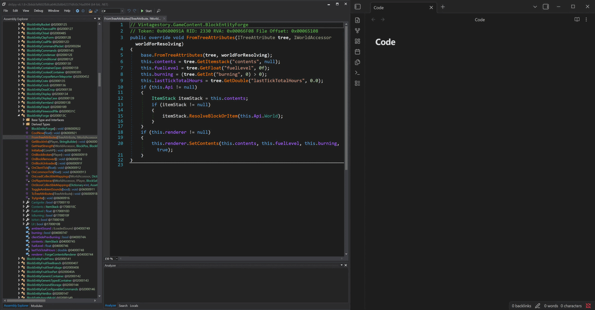
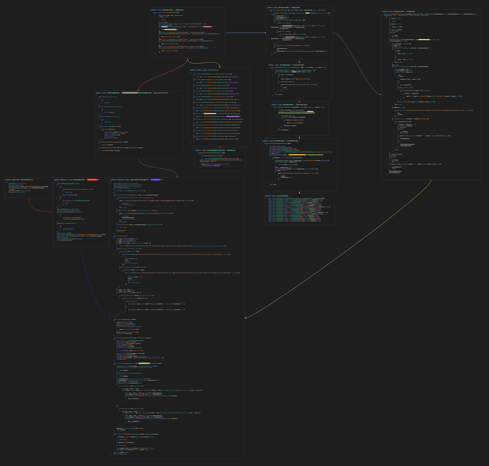

# dnSpy Markdown Copy Extension (for use with Obsidian)

Custom dnSpy extension that copies selected decompiled code as formatted, color-preserving Markdown, matching the default dnSpy dark theme.

## Demo

## Overview

This extension adds the ability to copy document text as Markdown while preserving the indentation and theme of the original text when pasted into Obsidian. 
I wanted a way to add code snippets from dnSpy to Obsidian notes while preserving dnSpy's theme and formatting, so I built this.

## Example Use Case: Obsidian Graph Integration
Embed structured, color-preserving code snippets within Obsidian graph view to clearly visualize and document execution flow.

## Usage

Select text within dnSpy, right-click, and select "Copy with Markdown" to copy formatted text to the clipboard.

## How It Works
 - Reads span color data from dnSpy's document viewer
 - Iterates over text selection and injects Markdown formatting and color annotations while preserving structure
 - Outputs the formatted text to clipboard

## Dependency 

Requires a minimal dnSpy fork that exposes 
 - `DocumentViewerContent.ColorCollection`:

Fork: https://github.com/yuleWorks/dnSpy-exposed-ColorCollection/

## Build

This project is intended to be built within the dnSpy source tree, specifically from within `dnSpy/Extensions/`.

After building, copy the compiled extension DLL to a folder within the forked dnSpy extension directory:

`dnSpy/dnSpy/bin/Release/netX.Y/win-x64/Extensions/DnSpyMarkdownExtension/`

## Notes

This was intended to be a one-off tool rather than a general-purpose extension framework.
